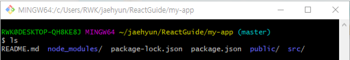
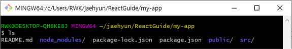
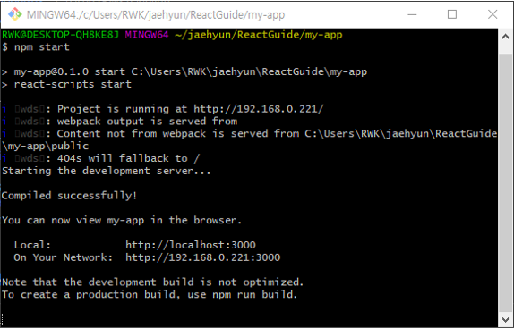
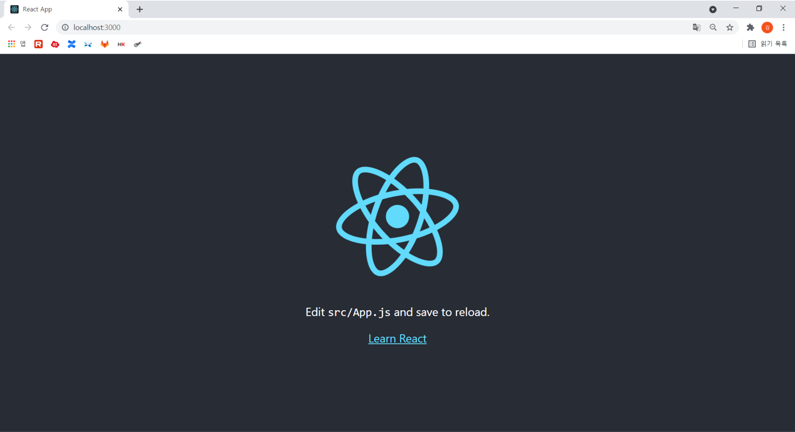

# React.js 시작하기

[React 공식 문서](https://ko.reactjs.org/docs/getting-started.html)를 통해서 설치부터 개념 정리까지 리액트 학습을 위한 레포입니다. 

## Installation

- `Node.js` (10.16 이상의 버전)
  - [Node.js 다운로드](https://nodejs.org/ko/download/)
- `npm`(5.6 이상의 버전)
  - Node.js 의 패키지 매니저(모듈)


## Create React App

React App 개발 시작하기

```bash
npx create-react-app [app-name]
cd app-name
npm start
```

- `npx`: `npm` 5.2 버전부터 제공된 기본 패키지로 `npm`을 통해 모듈을 로컬에 설치했어야만 실행시킬 수 있었던 기존의 문제점을 해결했다. 모듈을 로컬에 저장하지 않고, 매번 최신 버전의 파일만 임시로 불러와서 실행 시킨 후에, 그 파일은 없어지는 방식으로 모듈이 돌아간다. 
  ** [참고자료 - npm과 npx의 차이](https://ljh86029926.gitbook.io/coding-apple-react/undefined/npm-npx)

- 실행 결과 (my-app 이라는 이름으로 app 생성)

  
  - 리액트 앱을 만들게 되면 자동으로 `.git` 파일도 같이 생성되기 때문에 Git으로 관리하려면 이를 지워주면 됩니다. (Vue랑 똑같다)

    ```bash
    rm -r .git
    ```

    ** `rm`는 조심히 다뤄야하는 명령어입니다. [rm을 안전 옵션으로 실행](https://www.lesstif.com/system-admin/rm-rf-14090708.html)을 참고해서 사고를 예방하는 것도 괜찮을 것 같습니다.

    - 실행 결과

      

      (master) 표시가 안나오는 것으로 깃이 삭제된 것을 확인

  - `npm start`: 서버 실행

    - 실행 결과

      

    - 로컬에서 확인

      
    
  - 생성되는 파일 둘러보기

    ```jsx
    // index.js
    
    import React from 'react';
    import ReactDOM from 'react-dom';
    import './index.css';
    import App from './App';
    import reportWebVitals from './reportWebVitals';
    
    ReactDOM.render(
      <React.StrictMode>
        <App />
      </React.StrictMode>,
      document.getElementById('root')
    );
    
    // If you want to start measuring performance in your app, pass a function
    // to log results (for example: reportWebVitals(console.log))
    // or send to an analytics endpoint. Learn more: https://bit.ly/CRA-vitals
	reportWebVitals();
    ```

    - `React.StrictMode`: App의 잠재적인 문제를 알아내기 위한 도구
    
    ```jsx
    // App.js
    
    import logo from './logo.svg';
    import './App.css';
    
    function App() {
      return (
        <div className="App">
          <header className="App-header">
            
            <p>
              Edit <code>src/App.js</code> and save to reload.
            </p>
            <a
              className="App-link"
              href="https://reactjs.org"
              target="_blank"
              rel="noopener noreferrer"
            >
              Learn React
            </a>
          </header>
        </div>
      );
	}
    
    export default App;
    ```
    
    

## Hello World

가장 간단한 형태의 React 예시

```jsx
/* index.js */
ReactDOM.render(
	<h1>Hello World</h1>,
	document.getElementById('root');
)
```


## JSX 소개

- JSX

  : Javascript를 확장한 문법으로, 근본적으로는 `React.createElement(component, props, ...children)` 함수에 대한 *문법적 설탕(Syntactic sugar)를 제공합니다. 

  *문법적 설탕: 문법적 기능은 그대로지만 읽는 사람이 직관적으로 쉽게 코드를 읽을 수 있게 만듦

  ```jsx
  function getFullName(user) {
    return user.firstName + " " + user.lastName;
  }
  
  const chapter = "02_IntroduceJSX";
  
  const user = {
    firstName: "Kim",
    lastName: "Jaehyun",
  };
  
  /*
  div: 자식 포함하기
  h1: 변수 포함하기
  h2: 함수 호출 결과 포함하기
  */
  const element = (
    <div>
      <h1>{chapter}</h1>  
      <h2>Hello, {getFullName(user)}</h2>
    </div>
  );
  ```

  - JSX의 중괄호 안에는 유효한 모든 Javascript 표현식을 넣을 수 있다.

- JSX 속성 정의

  ```jsx
  // 속성에 따옴표를 사용한 문자열 리터럴 정의
  const elemA = <div tabIndex="0"></div>;
  // 중괄호를 사용한 어트리뷰트에 JS 표현식 삽입
  const elemB = </img>
  ```

  **JSX는 HTML보다는 JS에 가깝기 때문에, HTML 어트리뷰트 이름 대신  camelCase를 사용한다.** 

- JSX는 주입 공격을 방지합니다.

  ```jsx
  const title = response.potentiallyMaliciousInput;
  const element = <h1>{title}</h1>;
  ```

  - React DOM은 JSX에 삽입된 모든 값을 렌더링하기 전에 이스케이프 하므로, App에서 명시적으로 작성되지 않은 내용은 주입되지 않습니다. 모든 항목은 렌더링 되기 전에 문자열로 변환합니다. 이런 특성으로 *XSS(cross-site-scripting) 공격을 방지할 수 있습니다.

    *XSS: 스크립트 코드를 삽입 해 개발자가 고려하지 않은 기능이 작동하게 하는 공격으로, 사용자를 대상으로 한 공격이다. [참고자료](https://4rgos.tistory.com/1)

- JSX는 객체를 표현합니다.

  Babel은 JSX를 `React.createElement()` 호출로 컴파일 합니다.

  ```jsx
  const element = (
  	<h1 className="greeting">
  		Hello, world!
  	</h1>
  );
  ```

  ```jsx
  const element = React.createElement(
  	'h1',
  	{className: 'greeting'},
  	'Hello, world!'
  )
  ```

  

## 엘리먼트 렌더링

엘리먼트는 React 앱의 가장 작은 단위입니다. 브라우저 DOM 엘리먼트와 달리 일반 객체이며, 쉽게 생성할 수 있다. 

```jsx
/* index.js 일부 */
ReactDOM.render(
  <React.StrictMode>
    <App />
  </React.StrictMode>,
  document.getElementById("root")
);
```

- `App.js`의 내용을 루트 DOM 노드에 렌더링한다. 

```jsx
function tick() {
  const element = (
    <div>
      <h1>Hello, world!</h1>
      <h2>It is {new Date().toLocaleTimeString()}.</h2>
    </div>
  );
  ReactDOM.render(element, document.getElementById('root'));
}

setInterval(tick, 1000);
```

- 대부분의 React 앱은 `ReactDOM.render()`를 한번만 호출합니다. 


## Component와 Props

- 함수 컴포넌트와 클래스 컴포넌트

  - 컴포넌트를 정의하는 가장 간단한 방법은 Javascript 함수를 작성하는 것입니다. 

    ```jsx
    function Welcome(props) {
      return <h1>Hello, {props.name}</h1>;
    }
    ```

    - 위의 함수는 하나의 *props 객체 인자를 받은 후, React 엘리먼트를 반환하므로 React 컴포넌트 입니다. 이러한 컴포넌트는 Javascript 함수이기 때문에 "함수 컴포넌트"라고 호칭합니다.

  - 클래스 컴포넌트

    ```jsx
    class Welcome extends React.Component {
      render() {
        return <h1>Hello, {this.props.name}</h1>;
      }
    }
    ```

    - React의 관점에서 볼 때, 두 가지 유형의 컴포넌트는 동일하지만 각각의 유형은 몇 가지 추가 기능이 있다. 

- 컴포넌트 렌더링

  - React 엘리먼트의 사용자 정의 컴포넌트

    ```jsx
    const element = <Welcome name="Kim" />;
    ```

    - 컴포넌트 렌더링

      ```jsx
      function Welcome(props) {
      	return <h1> hello, {props.name} </h1>;
      }
      
      const element = <Welcome name="Sara" />;
      ReactDOM.render(
      	element,
      	document.getElementById('root')
      )
      ```

    **컴포넌트의 이름은 항상 대문자로 시작합니다. [이름 규칙 더보기](https://ko.reactjs.org/docs/jsx-in-depth.html#user-defined-components-must-be-capitalized)**

- 컴포넌트 합성

  - 자신의 출력에 다른 컴포넌트를 참조할 수 있습니다.

    ```jsx
    function Welcome(props) {
    	return <h1> hello, {props.name} </h1>;
    }
    
    function App() {
    	return {
    		<div>
    			<Welcome name="Park" />;
    			<Welcome name="Kim" />;
    			<Welcome name="Lee" />;
    		</div>
    	}
    }
    
    const element = <Welcome name="Sara" />;
    ReactDOM.render(
    	<App />
    	document.getElementById('root')
    )
    ```

- 컴포넌트 추출

  - 컴포넌트를 기능단위로 나눈다.

    ```jsx
    function Comment(props) {
      return (
        <div className="Comment">
          <div className="UserInfo">
            
            <div className="UserInfo-name">
              {props.author.name}
            </div>
          </div>
          <div className="Comment-text">
            {props.text}
          </div>
          <div className="Comment-date">
            {formatDate(props.date)}
          </div>
        </div>
      );
    }
    ```

    - 위의 코드는 다음과 같이 추출해서 단순화할 수 있다.

      ```jsx
      function Comment(props) {
        return (
          <div className="Comment">
            <UserInfo user={props.auther} />
            <div className="Comment-text">{props.text}</div>
          </div>
        );
      }
      
      function Avatar(props) {
        return (
          
        );
      }
      
      function UserInfo(props) {
        return (
          <div className="UserInfo">
            <Avatar user={props.auther} />
            <div className="UserInfo-name">{props.author.name}</div>
          </div>
        );
      }
      ```

- props는 읽기 전용입니다. 

  - 함수 컴포넌트나 클래스 컴포넌트는 모두 컴포넌트의 자체 props를 수정해서는 안됩니다. 

  - **모든 React 컴포넌트는 자신의 props를 다룰 때 반드시 \*순수 함수처럼 동작해야 합니다**

    \*순수 함수: 입력값을 바꾸려 하지 않고, 항상 동일한 입력값에 대해 동일한 결과를 반환


## State and Lifecycle

[엘리먼트 렌더링](#엘리먼트-렌더링)에서 다뤘던 `tick`컴포넌트를 완전히 재사용하고, 캡슐화하는 방법을 배울 것입니다. 

- 함수에서 클래스로 변환하기

  ```jsx
  class Clock extends React.Component {
    render() {
      return (
        <div>
          <h1>05_StateAndLifecycle</h1>
          <h2>It's {this.props.date.toLocaleTimeString()}.</h2>
        </div>
      );
    }
  }
  ```

  - `render()` 메서드는 업데이트가 발생할 때마 호출되지만, 같은 DOM 노드로 `<Clock />`를 렌더링하는 경우 `Clock` 클래스의 단일 인스턴스만 사용된다. 이것이 로컬 state와 생명주기 메서드와 같은 부가적인 기능을 사용할 수 있게 해준다.

- 클래스에 로컬 State 추가하기

  - `date`를 `props`에서 `state`로 이동시키기

    ```jsx
    import React from "react";
    
    class Clock extends React.Component {
      constructor(props) {
        super(props);
        this.state = { date: new Date() };
      }
      render() {
        return (
          <div>
            <h1>05_StateAndLifecycle</h1>
            <h2>It's {this.state.date.toLocaleTimeString()}.</h2>
          </div>
        );
      }
    }
    ```

    1. `render()` 메서드 안에 있는 `this.props.date`를 `this.state.date`로 변경
    2. `this.state`를 지정하는 `class constructor` 추가
       - **클래스 컴포넌트는 항상 `props`로 기본 constructor를 호출해야 한다**
    3. `Clock` 요소에서 date prop 삭제

- 생명주기 메서드를 클래스에 추가하기

  많은 컴포넌트가 있는 애플리케이션에서 **컴포넌트가 삭제될 때 해당 컴포넌트가 사용 중이던 리소스를 확보하는 것이 중요 **합니다.

  - 생명주기 메서드
    - `componentDidMount()`: 컴포넌트 출력물이 DOM에 렌더링 된 후에 실행되는 메서드
    - `componentWillUnmount()`: 컴포넌트에 의해 생성된 DOM이 삭제될 때 실행되는 메서드 

  - 최종 코드

    ```jsx
    import React from "react";
    
    class Clock extends React.Component {
      constructor(props) {
        super(props);
        this.state = { date: new Date() };
      }
    
      // 컴포넌트가 마운트 될 때 실행
      componentDidMount() {
        this.timerID = setInterval(() => this.tick(), 1000);
      }
    
      // 컴포넌트가 언마운트 될 때 실행
      componentWillUnmount() {
        clearInterval(this.timerID);
      }
    
      tick() {
        this.setState({ date: new Date() }); // 로컬 state 업데이트
      }
    
      render() {
        return (
          <div>
            <h1>05_StateAndLifecycle</h1>
            <h2>It's {this.state.date.toLocaleTimeString()}.</h2>
          </div>
        );
      }
    }
    
    export default Clock;
    ```

    - 실행 순서
      1. `Clock` 컴포넌트의 constructor를 호출하고, 현재 시각이 포함된 객체로 `this.state`를 초기화
      2. React는 `Clock`의 `render()` 메서드 호출해서 화면에 표시되어야할 내용을 파악한다. `Clock`의 렌더링 출력값을 일치시키기 위해 DOM을 업데이트한다.
      3. `Clock` 출력값이 DOM에 삽입되면, `componentDidMount()` 생명주기 메서드를 호출
      4. 매초 브라우저가 `tick()` 메서드를 호출하고, 그 안에서 `Clock` 컴포넌트는 `setState()`에 현재 시각을 포함하는 객체를 호출하며 UI를 업데이트한다. React는 `state`가 변경된 것을 인지하고, `render()` 메서드를 다시 호출하고, DOM을 업데이트한다. 
      5. `Clock` 컴포넌트가 DOM으로부터 한 번이라도 삭제된 적이 있다면 React는 타이머를 멈추기 위해 `componentWillUnmount()` 생명주기 메서드를 호출합니다.

- State

  - `setState()`

    - state를 수정할 때에는 직접 수정하지 마세요.

      - `this.state`를 지정할 수 있는 공간은 `constructor` 뿐입니다.
      - `this.setState()` 사용

    - state 업데이트는 비동기적일 수도 있습니다.

      React가 성능을 위해 여러 `setState()`를 단일 업데이트로 한번에 처리할 수 있기 때문에 다음 state를 계산할 때 `this.props`와 `this.state`에 의존적이면 안된다.

      - 실패할 수 있는 코드

        ```jsx
        this.setState({
          counter: this.state.counter + this.props.increment,
        });
        ```

      - 수정된 코드

        ```jsx
        this.setState((state, props) => ({
          counter: state.counter + props.increment
        }));
        ```

        - 객체보다는 함수의 인자로 사용하는 형태의 `setState()`

        ```jsx
        this.setState(function(state, props) {
          return {
            counter: state.counter + props.increment
          };
        });
        ```

        - 일반적인 함수에서도 잘 동작한다.

    - State 업데이트는 병합됩니다.

      - React는 제공한 객체를 현재 state로 병합합니다.
      - 별도의 `setState()` 호출로 변수를 독립적으로 업데이트할 수 있습니다.

    

## 이벤트 처리하기

React 엘리먼트에서 이벤트를 처리하는 방식은 DOM 엘리먼트에서 이벤트를 처리하는 방식과 매우 유사합니다.

- React 이벤트 처리 방식의 문법

  1. 캐멀 케이스(camelCase) 사용

  2. JSX를 사용하여 문자열이 아닌 함수로 이벤트 핸들러를 전달

     - HTML

       ```jsx
       <button onclick="activateLasers()">
       	Activate Lasers
       </button>
       ```

     - React

       ```jsx
       <button onclick={activateLasers}>
       	Activate Lasers
       </button>
       ```

  3. 기본동작 방지시 `preventDefault` 명시적으로 호출

     - HTML

       ```html
       <a href="#" onclick="console.log('The link was clicked.'); return false">
         Click me
       </a>
       ```

     - React

       ```jsx
       function ActionLink() {
         function handleClick(e) {
           e.preventDefault();
           alert("It was clicked");
         }
         return (
           <a href="/" onClick={handleClick}>
             Click me
           </a>
         );
       }
       ```

       - 여기서 `e`는 합성 이벤트입니다. React는 DOM엘리먼트가 생성되고, 리스너를 추가하기위해 `addEventListener`를 호출할 필요가 없습니다. 대신 엘리먼트가 렌더링될 때 리스너를 제공하면 됩니다. 

         ```jsx
         class Toggle extends React.Component {
           constructor(props) {
             super(props);
             this.state = {isToggleOn: true};
         
             // 콜백에서 `this`가 작동하려면 아래와 같이 바인딩 해주어야 합니다.
             this.handleClick = this.handleClick.bind(this);
           }
         
           handleClick() {
             this.setState(state => ({
               isToggleOn: !state.isToggleOn
             }));
           }
         
           render() {
             return (
               <button onClick={this.handleClick}>
                 {this.state.isToggleOn ? 'ON' : 'OFF'}
               </button>
             );
           }
         }
         ```

       - JSX 콜백에서 `this`의 의미에 주의해야 한다. Javascript에서 클래스 메서드는 기본적으로 바인딩되어 있지 않습니다. `this.handleClick`을 바인딩하지 않고, `onClick`에 전달하면, 함수가 실제로 호출될 때 `this`는 `undefined`가 됩니다.

       - 화살표 함수를 사용한 바인딩

         ```jsx
         render() {
           // 이 문법은 `this`가 handleClick 내에서 바인딩되도록 합니다.
           return (
             <button onClick={() => this.handleClick()}>
               Click me
             </button>
           );
         }
         ```

         - 대부분의 경우 문제가 되지 않으나, 컴포넌트가 렌더링될 때 마다 다른 콜백이 생성된다는 문제가 있음. 

- 이벤트 핸들러에 인자 전달하기

  루프 내부에서는 이벤트 핸들러에 추가적인 매개변수를 전달하는 것이 일반적입니다.

  ```jsx
  <button onClick={(e) => this.deleteRow(id, e)}>Delete Row</button>
  <button onClick={this.deleteRow.bind(this, id)}>Delete Row</button>
  ```


## 조건부 렌더링

React에서의 조건부 렌더링은 Javascript 조건처리와 같이 동작합니다. `if`나 `조건부 연산자`와 같은 연산자를 현재 상태의 엘리먼트를 만드는 데 사용하세요. 

[예시 코드](./my-app/src/07_ConditionalRendering.js)

- 예시코드의 조건부 렌더링

  ```jsx
  if(isLoggedIn) {
      button = <LogoutButton onClick={this.handleLogoutClick} />;
    } else {
      button = <LoginButton onClick={this.handleLoginClick} />;
  }
  ```

- 논리 연산자 && 로 if를 인라인으로 표현하기

  ```jsx
  function Mailbox(props) {
    const unreadMessages = props.unreadMessages;
    return (
      <div>
        <h1>Hello!</h1>
        {unreadMessages.length > 0 &&
          <h2>
            You have {unreadMessages.length} unread messages.
          </h2>
        }
      </div>
    );
  }
  
  const messages = ['React', 'Re: React', 'Re:Re: React'];
  ```

  - `true && expression`은 항상 `true`으로 평가되고, `false && expression`은 항상 `false`로 평가된다. 

- 조건부 연산자로 `if-else` 구문 인라인으로 표현하기

  - 조건부 연산자: `condition ? true : false`

    ```jsx
    render() {
      const isLoggedIn = this.state.isLoggedIn;
      return (
        <div>
          {isLoggedIn
            ? <LogoutButton onClick={this.handleLogoutClick} />
            : <LoginButton onClick={this.handleLoginClick} />
          }
        </div>
      );
    }
    ```

- 컴포넌트가 렌더링하는 것을 막기

  - 컴포넌트 자체를 숨기고싶을 때 `null`을 반환해준다.

    ```jsx
    function WarningBanner(props) {
      if (!props.warn) {
        return null;
      }
    
      return (
        <div className="warning">
          Warning!
        </div>
      );
    }
    ```

    

## 리스트와 Key

엘리먼트 모음을 만들고, 중괄호 `{}`를 사용해서 JSX에 포함시킬 수 있습니다.

```jsx
function NumberList(props) {
  const numbers = props.numbers;
  const listItems = numbers.map(function (number) {
    return <li>{number}</li>;
  });
  return <ul>{listItems}</ul>;
}

function NumberToList(props) {
  const numbers = [1, 2, 3, 4, 5, 6, 7, 8];
  return <NumberList numbers={numbers} />;
}

export default NumberToList;
```

- `Warning: Each child in a list should have a unique "key" prop.` 

  - 리스트의 각 항목에 *key를 넣어줘야 함

    *key: 엘리먼트 리스트를 만들 떄 포함해야 하는 특수한 문자열 어트리뷰트

- Key

  React가 어떤 항목을 변경, 추가 또는 삭제할지 식별하는 것을 돕습니다. 엘리먼트의 안정적인 고유성을 부여하기 위해 배열 내부의 엘리먼트에 지정해야 한다.

  - Key를 선택하는 가장 좋은 방법은 데이터의 ID를 사용하는 것이다. 렌더링 항목에 적절한 ID가 없을 경우, 항목의 인덱스를 key로 사용할 수 있다.

    ```jsx
    const todoItems = todos.map((todo, index) =>
      // Only do this if items have no stable IDs
      <li key={index}>
        {todo.text}
      </li>
    );
    ```

    - 항목의 순서가 바뀔 수 있는 경우 권장하지 않음
    - [Index를 키로 사용할 경우 발생하는 문제](https://robinpokorny.medium.com/index-as-a-key-is-an-anti-pattern-e0349aece318)

  - Key로 컴포넌트 추출하기

    ```jsx
    function ListItems(props) {
      // key 지정 X
      return <li>{props.value}</li>;
    }
    
    function ListAndKeys(props) {
      const numbers = [1, 2, 3, 4];
      const listItems = numbers.map(function (number) {
        // 배열 안에 key 지정
        return <ListItems key={number.toString()} value={number} />;
      });
      return (
        <ul>{listItems}</ul>
      );
    }
    ```

    

## 폼

HTML 폼 엘레먼트 자체가 내부 상태를 가지기 때문에 React의 다른 DOM 엘리먼트와 조금 다르게 동작합니다. 

- 제어 컴포넌트(Controlled Component)

  : React에 의해 값이 제어되는 입력 폼 엘리먼트
  
  ```jsx
  class NameForm extends React.Component {
    constructor(props) {
      super(props);
      this.state = {value: ''};
  
      this.handleChange = this.handleChange.bind(this);
      this.handleSubmit = this.handleSubmit.bind(this);
    }
  
    handleChange(e) {
      this.setState({value: e.target.value});
    }
    handleSubmit(e) {
      alert("Your name is "+this.state.value);
      e.preventDefault();
    }
  
    render() {
      return (
        <form onSubmit={this.handleSubmit}>
          <label>Name
            <input type="text" value={this.state.value} onChange={this.handleChange} />
          </label>
          <input type="submit" value="Submit" />
        </form>
      )
    }
  }
  ```
  
  - 모든 키 입력에 대해서 React state가 업데이트 되는 `handleChange` 실행
  
- `textarea` 태그

  React에서 `<textarea>`는 `value` 어트리뷰트를 대신 사용합니다. 이렇게 하면 `<textarea>`를 사용하는 폼은 한 줄 입력을 사용하는 폼과 비슷하게 작성할 수 있습니다. 

  ```jsx
  <textarea value={this.state.value} onChange={this.handleChange} />
  ```

- `select` 태그

  React에서는 `selected` 어트리뷰트를 사용하는 대신 `select` 태그에 `value` 어트리뷰트를 사용합니다. 

  - HTML

    ```html
    <select>
      <option value="grapefruit">Grapefruit</option>
      <option value="lime">Lime</option>
      <option selected value="coconut">Coconut</option>
      <option value="mango">Mango</option>
    </select>
    ```

  - React

    ```jsx
    <select value={this.state.value} onChange={this.handleChange}>
      <option value="grapefruit">Grapefruit</option>
      <option value="lime">Lime</option>
      <option value="coconut">Coconut</option>
      <option value="mango">Mango</option>
    </select>
    ```

  - `select` 태그에 multiple 옵션을 허용한다면, `value` 어트리뷰트에 배열을 전달할 수 있다. 

- `file input` 태그

  HTML에서 `<input type="file>"`은 하나 이상의 파일을 자신의 장치 저장소에서 서버로 업로드 하거나 [File API](https://developer.mozilla.org/en-US/docs/Web/API/File/Using_files_from_web_applications)를 통해 Javascript로 조작할 수 있습니다. 값이 읽기 전용이기 때문에 React에서는 [비제어 컴포넌트](https://ko.reactjs.org/docs/uncontrolled-components.html#the-file-input-tag) 입니다. 

- 다중 입력 제어하기

  각 엘리먼트에 `name` 어트리뷰트를 추가하고, `event.target.name`값을 통해 작업을 선택할 수 있게 한다. [예시 코드](./my-app/src/09_MultiInputControl.js)

  ```jsx
  handleInputChange(e) {
      const target = e.target;
      const value = target.type === "checkbox" ? target.checked : target.value;
      const name = target.name;
      this.setState({ [name]: value });
    }
  ```

  - `this.setState({ [name]: value });`는 ES6의 *computed property name 이 사용됨

    *computed property name: `[]`안에서 계산된 식의 결과가 속성명으로 사용됨


## State 끌어올리기

동일한 데이터에 대한 변경사항을 여러 컴포넌트에 반영해야 할 필요가 있습니다. 이럴 때에는 가장 가까운 공통조상으로 state를 끌어올리는 것이 좋습니다. (state 자체를 조상단계까지 끌어올림)

- [10_TemperatureInput.js](./my-app/src/10_TemperatureInput.js)

  ```jsx
  import React from "react";
  
  // HTML 텍스트를 위함
  const scaleNames = {
    c: "Celsius",
    f: "Farhrenheit",
  };
  
  class TemperatureInput extends React.Component {
    constructor(props) {
      super(props);
      this.handleChange = this.handleChange.bind(this);
    }
  
    // props로 전달된 onTemperatureChange(조상의 setState) 실행
    handleChange(e) {
      this.props.onTemperatureChange(e.target.value);
    }
  
    render() {
      const temperature = this.props.temperature;
      const scale = this.props.scale;
      return (
        <fieldset>
          <legend>Enter temperature in {scaleNames[scale]}</legend>
          <input value={temperature} onChange={this.handleChange} />
        </fieldset>
      );
    }
  }
  
  export default TemperatureInput;
  ```

- [10_Calculator](./my-app/src/10_Calculator.js)

  ```jsx
  import BoolingVerdict from "./10_BoilingVerdict";
  import TemperatureInput from "./10_TemperatureInput";
  import React from "react";
  
  function toCelsius(farhrenheit) {
    return ((farhrenheit - 32) * 5) / 9;
  }
  
  function toFarhrenheit(celsius) {
    return (celsius * 9) / 5 + 32;
  }
  
  // 익명함수 convert
  function tryConvert(temperature, convert) {
    const input = parseFloat(temperature);
    if (Number.isNaN(input)) {
      return "";
    }
    const output = convert(input);
    const rounded = Math.round(output * 1000) / 1000;
    return rounded.toString();
  }
  
  class Calculator extends React.Component {
    constructor(props) {
      super(props);
      this.state = {
        temperature: "",
        scale: "",
      };
      this.handleCelsiusChange = this.handleCelsiusChange.bind(this);
      this.handleFahrenheitChange = this.handleFahrenheitChange.bind(this);
    }
  
    handleCelsiusChange(temperature) {
      this.setState({ scale: "c", temperature });
    }
  
    handleFahrenheitChange(temperature) {
      this.setState({ scale: "f", temperature });
    }
  
    render() {
      const scale = this.state.scale;
      const temperature = this.state.temperature;
      // scale 값에 따라 섭씨 <-> 화씨 변경 함수 실행
      const celsius =
        scale === "f" ? tryConvert(temperature, toCelsius) : temperature;
      const farhrenheit =
        scale === "c" ? tryConvert(temperature, toFarhrenheit) : temperature;
  
      return (
        <div>
          <h1>10_Lifting State Up</h1>
          <TemperatureInput
            scale="s"
            temperature={celsius}
            onTemperatureChange={this.handleCelsiusChange}
          />
          <TemperatureInput
            scale="f"
            temperature={farhrenheit}
            onTemperatureChange={this.handleFahrenheitChange}
          />
          <BoolingVerdict celsius={parseFloat(celsius)} />
        </div>
      );
    }
  }
  
  export default Calculator;
  ```

- 입력값을 변경할 때 생기는 일들

  1. `<input>`의 `onChange()`에 지정된 함수를 호출. (예시 코드에서는 `TemperatureIntput`의 `onChagne()` 메서드)
  2. `TemperatureInput` 컴포넌트의 `handleChange`가 `this.props.onTemperatureChange()` 호출.
  3. 섭씨/화씨에 따라 `Calculator`의 `handleCelsiusChange()` 와 `handleFahrenheitChange()`중 하나의 메서드를 호출.
  4. 호출된 메서드가 `this.setState()`를 호출해서 React에 자신을 렌더링하도록 요청
  5. React는 UI가 어떻게 보여야 하는지 알아내기 위해 `Calculator`컴포넌트의 `render()`메서드  호출. -> 온도의 변환이 이 단계에서 실행됨
  6. React가 `Calculator`가 전달한 새 props와 함께 `TempeartureInput` 컴포넌트의 `render()` 메서드 호출
  7. `BoilingVerdict` 컴포넌트에 섭씨 온도를 `props`로 건내면서 해당 컴포넌트의 `render()` 메서드 호출
  8. React DOM은 입력값과 물의 끓음 여부를 일치시키는 작업과 함께 DOM을 갱신. 값을 입력한 필드는 현재 입력값을 그대로 받고, 다른 입력 필드는 변환된 온도 값으로 갱신.


## Appendix

### preventDefault

- 사용 목적
  1. a 태그를 눌렀을 때에도 href 링크로 이동하지 않게 할 경우
  2. form 안에 submit 역할을 하는 버튼을 눌렀어도 새로 실행하지 않게 하고 싶을 경우(submit은 작동)

### state와 props의 차이점

`state`와 `props`는 모두 일반 Javascript 객체이고, 렌더링 결과물에 영향을 주는 정보를 갖고있습니다. `props`는 함수 매개변수처럼 **컴포넌트에 전달**되는 반면 `state`는 함수 내에 선언된 변수처럼 **컴포넌트 안에서 관리**됩니다.

[공식문서: state와 props의 차이점](https://ko.reactjs.org/docs/faq-state.html#what-is-the-difference-between-state-and-props)

### Error Handling

- Uncaught TypeError: Cannot read property 'setState' of undefined
  - 함수를 바인딩하지 않았을 경우 발생
  - [이벤트 처리하기](#이벤트-처리하기) 참고

